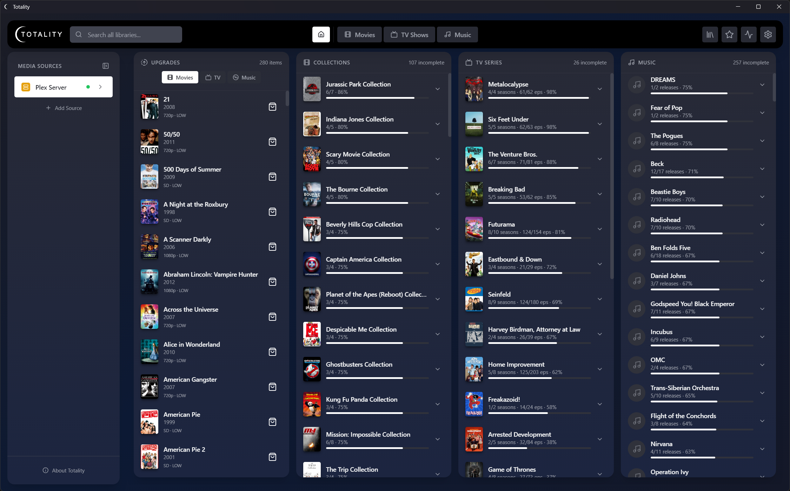
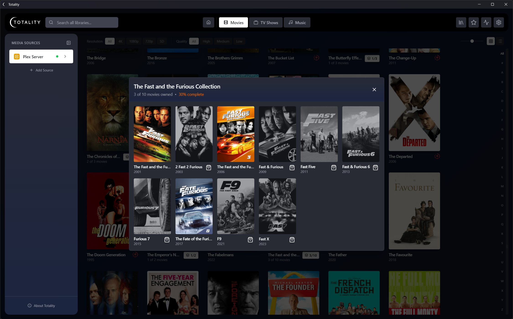
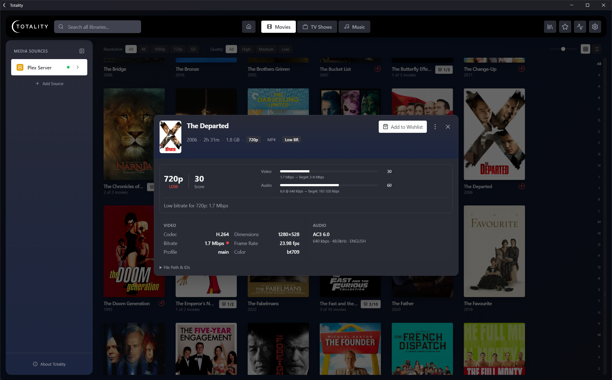
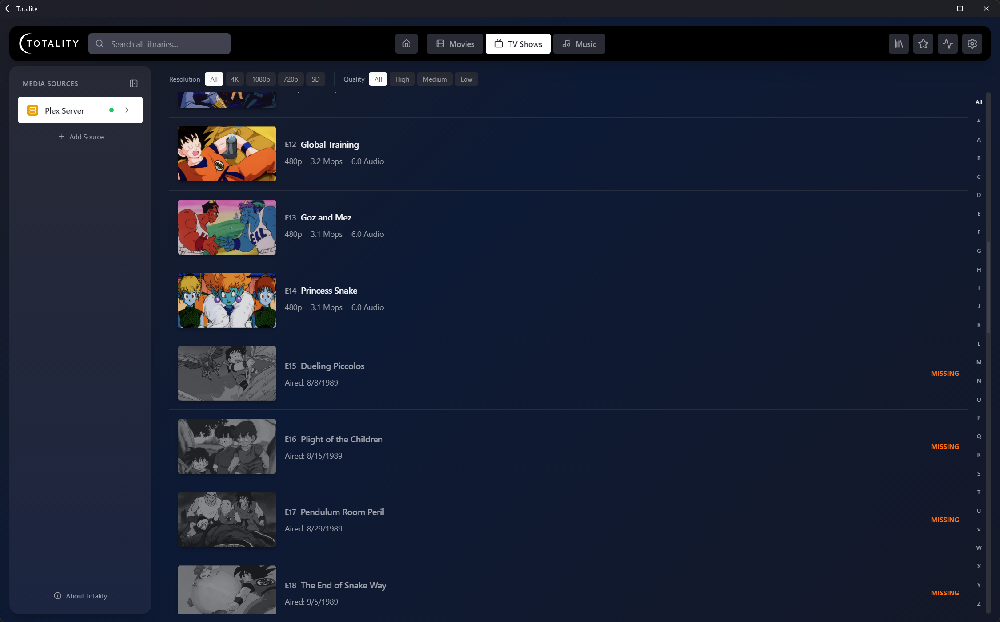
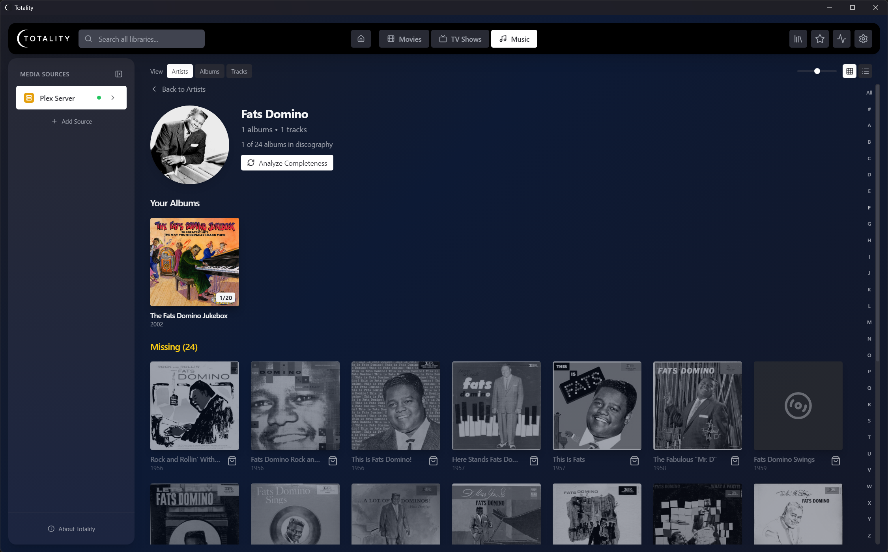
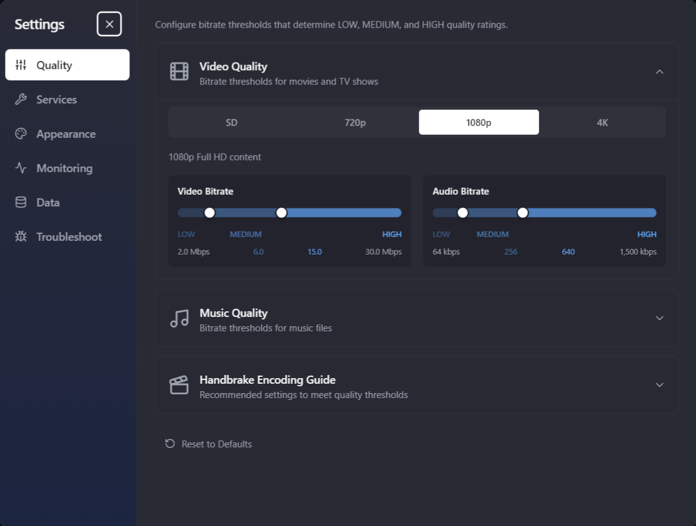

# Totality

A desktop application for analyzing and managing your media library quality across multiple media servers and local folders.

Totality connects to your media servers (Plex, Jellyfin, Emby, Kodi) and local folders to provide detailed quality analysis of your movies, TV shows, and music. It helps you identify items that could be upgraded to higher quality versions, tracks your collection completeness, and maintains a wishlist of media you want to acquire.

## Screenshots

### Dashboard
Track upgrades, incomplete collections, TV series, and music discographies at a glance.



### Movie Collections
See which movies you own in a franchise and which ones are missing.



### Quality Analysis
Detailed quality breakdown for each item — resolution, bitrate, codec, audio format, and scoring.



### TV Series Completeness
Track owned and missing episodes across all seasons with TMDB integration.



### Music Library
Browse artists, albums, and tracks with MusicBrainz discography completeness.



### Settings
Configure quality thresholds, API keys, monitoring intervals, and appearance.



## Features

### Multi-Source Support

Connect to multiple media sources simultaneously:
- **Plex** - Full support with OAuth authentication
- **Jellyfin** - Full support with server discovery (UDP broadcast)
- **Emby** - Full support with server discovery
- **Kodi** - Local database access and MySQL backend support
- **Local Folders** - Direct folder scanning with FFprobe analysis and TMDB/MusicBrainz metadata lookup

### Video Quality Analysis

Automatically analyzes your movies and TV shows for:
- **Resolution** - SD, 720p, 1080p, 4K with quality tier scoring
- **HDR Format** - Dolby Vision, HDR10, HDR10+, HLG
- **Color Depth** - 8-bit, 10-bit, 12-bit
- **Video Bitrate** - With codec efficiency multipliers (H.264, HEVC, AV1, VP9)
- **Audio Format** - Dolby Atmos, DTS:X, TrueHD, DTS-HD MA, and more
- **Quality Issues** - Identifies low bitrate, missing HDR, suboptimal audio

#### Quality Scoring System

Items are scored within tiers (SD/720p/1080p/4K) as LOW, MEDIUM, or HIGH based on:
- Video bitrate relative to resolution
- Codec efficiency (AV1 > HEVC > H.264)
- Audio codec quality ranking

### Music Quality Analysis

Analyzes audio tracks with a four-tier quality rating system:

| Tier | Description | Criteria |
|------|-------------|----------|
| **Ultra** | Hi-Res Lossless | Lossless codec (FLAC/ALAC/WAV) with 24-bit+ depth OR >48kHz sample rate |
| **High** | CD-Quality Lossless | Lossless codec at 16-bit / 44.1-48kHz |
| **Medium** | Transparent Lossy | MP3 ≥160 kbps or AAC ≥128 kbps |
| **Low** | Low Bitrate Lossy | MP3 <160 kbps or AAC <128 kbps |

### Completeness Tracking

#### TV Series (TMDB Integration)
- Shows missing episodes per season
- Displays series status (Returning, Ended, Canceled)
- Tracks overall collection completeness percentage
- Caches series IDs for efficient scanning

#### Movie Collections (TMDB Integration)
- Groups movies by franchise using TMDB's collection data
- Shows owned vs missing movies in collections
- Displays collection completion percentage

#### Music (MusicBrainz Integration)
- Analyzes artist discographies
- Shows owned vs missing albums
- Tracks album completeness (missing tracks)
- Filters to digital/CD releases only (excludes vinyl-only releases)
- Supports EPs and singles tracking

### Local Folder Scanning

Scan local media folders without a media server:
- **FFprobe Integration** - Extracts resolution, codecs, bitrate, HDR info, audio tracks
- **Auto-download FFprobe** - Downloads FFprobe binaries automatically on Windows
- **Smart Filename Parsing** - Extracts title, year, season/episode from filenames
- **Embedded Metadata** - Reads MKV/MP4 tags for accurate metadata
- **TMDB Lookup** - Fetches missing metadata from TMDB
- **Extras Filtering** - Automatically excludes featurettes, trailers, behind-the-scenes content

### Wishlist / Shopping List

Track media you want to acquire:
- Add movies, TV shows, albums to your wishlist
- Set priority levels and add notes
- Search external stores (Amazon, iTunes, etc.) for purchase options
- Bulk operations support

### Live Monitoring

Automatic library change detection:
- Polls enabled sources on configurable intervals
- Detects added, updated, and removed items
- Pauses during manual scans
- Real-time notifications of changes

### Background Task Queue

Manage long-running operations:
- Queue multiple scan and analysis tasks
- Pause, resume, and cancel tasks
- Reorder task priority
- View task history (completed, failed, cancelled)

### Library Views

#### Grid View
- Poster-based display with hover effects
- Adjustable grid scale (7 levels)
- Quality badges on items

#### List View
- Compact list display
- Quality and status badges
- Sortable columns

#### Alphabet Filter
- Quick navigation by first letter
- Special filter for non-alphabetic characters (#)

### Search
- Real-time search across all media types
- Searches titles, artists, and album names

### Security

- **Credential Encryption** - API keys and passwords encrypted at rest using OS-level encryption (Windows DPAPI, macOS Keychain, Linux libsecret)
- **Context Isolation** - Renderer process isolated from Node.js for security

## Getting Started

### Installation

```bash
# Clone the repository
git clone https://github.com/bbidwell85/totality.git
cd totality

# Install dependencies
npm install

# Start development mode
npm run electron:dev

# Build for production
npm run build
```

### Adding a Media Source

1. Click the **+** button in the sidebar under "Sources"
2. Select your source type (Plex, Jellyfin, Emby, Kodi, or Local Folder)
3. Follow the authentication/setup flow:
   - **Plex**: Click "Sign in with Plex" to authenticate via browser
   - **Jellyfin/Emby**: Enter server URL and credentials, or use auto-discovery
   - **Kodi**: Select local database or enter MySQL connection details
   - **Local Folder**: Browse to select folder path, choose library type (Movies/TV/Music)
4. Select which libraries to scan

### Scanning Libraries

1. Click the refresh icon next to a library in the sidebar
2. Wait for the scan to complete
3. Progress is shown in the sidebar and task queue

### Analyzing Completeness

#### For TV Shows and Movies:
1. Click the "Completeness" button in the toolbar
2. Click "Analyze Series" or "Analyze Collections"
3. Wait for the analysis to complete (requires TMDB API key)

#### For Music:
1. Navigate to the Music library
2. Select an artist
3. Click "Analyze Completeness" to check against MusicBrainz
4. View missing albums and tracks

### Viewing Quality Details

#### Movies/TV Shows:
- Click on any item to open the details panel
- Quality badges show HDR format, resolution, audio format
- Quality issues are displayed in the header

#### Music Tracks:
- Click on any track in an album view
- A modal shows the quality tier and scoring criteria
- View your track's specs compared to the tier requirements

## Configuration

### TMDB API Key
Required for movie/TV completeness analysis and local folder metadata:
1. Go to Settings
2. Enter your TMDB API key
3. Save settings

### Database Location
The SQLite database is stored at:
- **Windows**: `%APPDATA%\totality\totality.db`
- **macOS**: `~/Library/Application Support/totality/totality.db`
- **Linux**: `~/.config/totality/totality.db`

### FFprobe Location
Auto-downloaded to (or manually place at):
- **Windows**: `%APPDATA%\totality\ffprobe\`

## Keyboard Shortcuts

| Shortcut | Action |
|----------|--------|
| `Ctrl/Cmd + F` | Focus search |
| `Escape` | Close modal/panel |
| `G` | Toggle grid view |
| `L` | Toggle list view |

## Development

### Project Structure

```
src/
├── main/           # Electron main process
│   ├── services/   # Backend services (Database, API clients, analyzers)
│   ├── providers/  # Media server providers (Plex, Jellyfin, Emby, Kodi, Local)
│   ├── database/   # Schema and migrations
│   └── ipc/        # IPC handlers
├── preload/        # Preload scripts (IPC bridge)
└── renderer/       # React frontend
    └── src/
        ├── components/  # React components
        ├── contexts/    # React contexts (Source, Wishlist, Toast, Navigation)
        └── styles/      # CSS styles
```

### Commands

```bash
npm run electron:dev   # Start Vite + Electron together (recommended)
npm run build          # TypeScript + Vite + Electron Builder
npm run lint           # Run ESLint
npm run test           # Run Vitest in watch mode
npm run test:run       # Run all tests once
npm run test:coverage  # Run tests with coverage
```

### Tech Stack

- **Electron** 27 - Desktop framework
- **React** 18 - UI framework
- **TypeScript** - Type safety
- **Vite** 5 - Build tool
- **Tailwind CSS** - Styling
- **SQL.js** - SQLite database (in-memory with disk persistence)
- **Axios** - HTTP client

## API Integrations

- **Plex API** - Media server with OAuth authentication
- **Jellyfin API** - Media server with UDP discovery
- **Emby API** - Media server
- **TMDB API** - Movie/TV metadata and collections (rate-limited: 40 req/s)
- **MusicBrainz API** - Music metadata and discographies (rate-limited: 1 req/s)

## License

MIT License - See LICENSE file for details.
